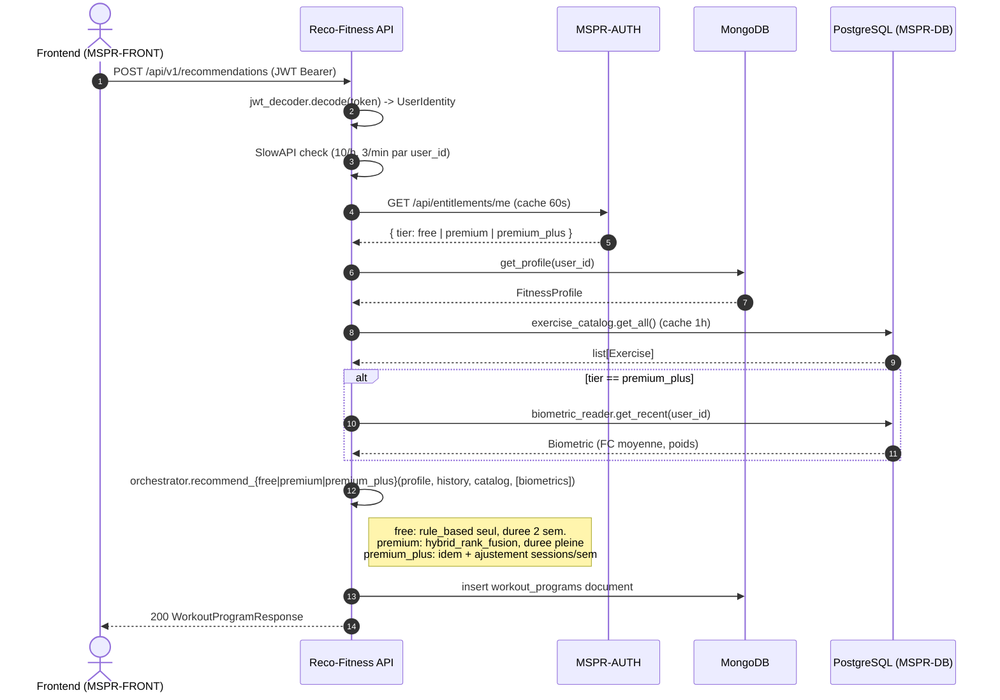

# ARCHITECTURE.md, MSPR-Reco-Fitness

Document de transmission. Lis-le avant de toucher au code : il explique **pourquoi** le service est construit comme ca, pas seulement comment. Le README repond a "comment lancer", ce fichier repond a "comment penser le service".

Reference fonctionnelle : [PRD #13](https://github.com/whitefoxxyt/MSPR-HealthAI-Coach-Reco-Fitness-/issues/13). Plan technique : tickets RF-1 a RF-16.

---

## 1. Vision

Le service est un **moteur de recommandations fitness microservice**, brique IA de la plateforme HealthAI Coach (MSPR2). Sa raison d'etre :

- Generer un programme d'entrainement personnalise pour un utilisateur, en moins de 500 ms.
- Justifier le freemium produit (free / premium / premium_plus) en degradant la qualite de la recommandation par paliers nets.
- Demontrer au jury MSPR2 (RNCP36581 E6.2) la maitrise d'un cycle ML complet : entrainement, evaluation, ajustement par feedback.

Il est **independant des autres services metier** (zero appel HTTP a MSPR-API) et **delegue l'authentification a MSPR-AUTH**. Il lit le catalogue d'exercices en read-only depuis MSPR-DB et persiste tout son etat dans MSPR-MongoDB.

---

## 2. Architecture cible

### 10 modules deep + scripts + integration cross-services

**Principe : interface fine, implementation profonde.** Chaque module expose 2 a 5 fonctions publiques mais cache plusieurs dizaines de lignes de logique. Pas de boilerplate transversal, pas de classes "manager".

| # | Module | Role | Interface publique |
|---|--------|------|--------------------|
| 1 | `services/jwt_decoder.py` | Decode HS256 local avec `BETTER_AUTH_SECRET` | `decode(token) -> UserIdentity` |
| 2 | `services/entitlements_client.py` | Appel cache TTL 60s a MSPR-AUTH avec degrade safe vers `free` | `get_entitlements(user_id, jwt) -> Entitlements` |
| 3 | `services/fitness_profile_service.py` | CRUD du profil Mongo (`user_fitness_profiles`) | `get_profile`, `upsert_profile` |
| 4 | `services/exercise_catalog.py` | Cache applicatif TTL 1h du catalogue PG read-only | `get_all(session) -> list[Exercise]` |
| 5 | `services/biometric_reader.py` | Lecture des biometriques recentes (FC, poids) depuis PG | `get_recent(user_id, session) -> Biometric \| None` |
| 6 | `services/scoring_rule_based.py` | 5 fonctions de matching + score lineaire pondere | `score_exercise(ex, profile, history) -> float` |
| 7 | `services/scoring_ml.py` | Charge le bundle pickle, predit le score | `score_exercise(ex, profile) -> float` |
| 8 | `services/workout_program_orchestrator.py` | Compose rule-based + ML selon tier, structure semaine/seance/exercice | `recommend_free`, `recommend_premium`, `recommend_premium_plus` |
| 9 | `services/feedback_service.py` | Upsert idempotent du feedback dans `recommendation_history` | `record_feedback(user_id, program_id, ...) -> dict` |
| 10 | `services/program_history_service.py` | Lecture paginee des programmes generes et feedbacks envoyes | `list_programs`, `list_feedback` |

**Modules auxiliaires :**

- `services/training_data.py` : generation d'un dataset synthetique etiquete par le rule-based (oracle).
- `services/scoring_trainer.py` : pipeline d'entrainement `CSV -> RandomForest + metrics report`.
- `services/eval_metrics.py` : calcul des 7 metriques du PRD pour le livrable jury.

**Scripts CLI (`scripts/`) :**

- `generate_training_data.py` : produit `data/training/scoring_dataset.csv` (5000+ lignes).
- `train_scoring_model.py` : persiste `app/data/scoring_model.pkl` + `training_report.json`.
- `eval_metrics.py` : produit `docs/metrics.{json,md}` + 3 PNG. Entraine un modele ephemere reproductible via seed.

**Integration cross-services :**

| Service externe | Direction | Quoi |
|-----------------|-----------|------|
| MSPR-AUTH (`/api/entitlements/me`) | sortant | tier d'abonnement (cache 60s, degrade vers free si timeout) |
| MSPR-AUTH (HS256 secret partage) | local | decode JWT sans round trip HTTP |
| MSPR-DB (table `exercises`) | sortant (read-only) | catalogue source des recommandations (cache 1h) |
| MSPR-DB (tables `biometric_entries`) | sortant (read-only, premium+) | dernieres mesures biometriques pour ajuster la charge |
| MSPR-MongoDB | bidirectionnel | profils, programmes, historique feedback |

---

## 3. Flux principal `POST /api/v1/recommendations`

---

## 4. Decisions clefs et leur justification

### D1. Microservice independant, NoSQL exige

Le PDF MSPR2 (livrable IV) exige un microservice IA connecte a une base NoSQL. Mongo couvre les besoins de profils et programmes (documents heterogenes), et nous evite de polluer le schema PG centralise par des structures specifiques fitness.

**Consequence :** zero couplage HTTP avec MSPR-API. La duplication legere (decode JWT, lecture du catalogue) est volontaire.

### D2. Scoring rule-based en oracle du ML

Le dataset d'entrainement est synthetique : 5000+ paires `(exercice, profil)` etiquetees par `scoring_rule_based.score_exercise`. Le ML apprend a **generaliser** sur des combinaisons inedites du vocab du catalogue.

**Pourquoi :** sans donnees de prod, il faut un signal de verite reproductible. Le rule-based est explicable et stable : c'est le meilleur oracle disponible. Le ML est valide quand son F1 sur ce signal depasse 0.8.

### D3. Fusion rule-based + ML par moyenne des rangs (Premium)

Top-N rule-based et Top-N ML sont fusionnes par moyenne ponderee des rangs (50/50). Un exercice absent d'une liste herite du rang `max+1`. Filtre dur (limitations / equipement) applique en amont.

**Pourquoi :** la fusion par score brut force a normaliser deux echelles differentes. La fusion par rang est robuste, monotone, et donne immediatement un Top-K coherent.

### D4. Freemium graduel par tier (PRD Q4)

| Tier | Strategie | Duree | Adaptive |
|------|-----------|-------|----------|
| free | rule_based seul | 2 semaines fixes | non |
| premium | hybrid_rank_fusion | pleine selon goal (4 a 6 sem.) | oui (feedback dans novelty) |
| premium_plus | hybrid_rank_fusion + biometrique | pleine | oui + ajustement charge (FC > 80 bpm -> -1 seance/sem) |

**Pourquoi :** le client doit ressentir le delta a l'upgrade. Le free livre une experience minimale fonctionnelle, le premium ajoute la sophistication ML, le premium_plus ajoute l'individualisation biometrique.

### D5. Cle de rate-limit = `user_id` extrait du JWT

SlowAPI utilise `user_id` du JWT plutot que l'IP : un utilisateur derriere NAT n'est pas penalise pour le trafic de ses voisins. Fallback IP si le header est absent ou invalide (defense contre les requetes anonymes).

### D6. Degrade safe sur MSPR-AUTH down

`entitlements_client.get_entitlements` retourne `tier=free` si MSPR-AUTH timeout ou repond en erreur. Disponibilite > qualite de la recommandation : un utilisateur premium momentanement degrade en free est moins grave qu'un 503 global.

### D7. Cache applicatif TTL 1h sur le catalogue PG

Le catalogue change peu (quelques exercices ajoutes par semaine). Charger 70 lignes a chaque requete serait du gaspillage et augmenterait la latence p95. Le cache est process-local : pas de Redis pour le scope MSPR2.

### D8. PUT feedback idempotent

`feedback_service.record_feedback` upsert sur la cle `(user_id, program_id, exercise_id)`. Plusieurs PUT successifs avec le meme corps produisent le meme document. Permet aux clients de retry sans creer de doublons.

### D9. Decode JWT local plutot que round trip a MSPR-AUTH

Verifier le JWT a chaque requete via MSPR-AUTH ajouterait 1 round trip a chaque appel. Le secret HS256 est partage, le decode local est O(1) en CPU. Trade off : pas de revocation possible (un JWT vole reste valide jusqu'a expiration), acceptable au scope MSPR2.

### D10. Tags OpenAPI en francais

Tags : `Sante`, `Profil`, `Recommandations`, `Feedback`, `Historique`. Aligne avec la cible de comprehension du jury et du frontend francais. La liste est verrouillee dans le test `tests/unit/test_openapi.py::test_all_endpoints_use_official_tags`.

---

## 5. Conventions du projet

### Auth, prefixe, pattern `/me`

- Tous les endpoints metier sont prefixes par `/api/v1/` (versioning explicite).
- L'endpoint `/health` est non versionne (cible des sondes liveness/readiness).
- Tout endpoint qui agit sur un utilisateur utilise `/me` : `GET /fitness-profile/me`, `GET /programs/me`, `GET /feedback/me`. Le `user_id` vient toujours du JWT, **jamais** d'un parametre d'URL ou de corps. Verrouillage de securite : un utilisateur ne peut pas lire les donnees d'un autre en manipulant l'URL.

### Persistance

- **Mongo** pour tout etat applicatif specifique au service (profils, programmes, historique feedback). Collections initialisees par MSPR-MongoDB (`init_mongo.py`).
- **PostgreSQL** pour le catalogue d'exercices (read-only, partage avec les autres services MSPR).
- **Pas de migrations Mongo** : les schemas sont declares cote Python (Pydantic). Init des index dans `app/db/init_mongo.py`.

### Reponses HTTP communes

Centralisees dans `app/openapi_responses.py` : `UNAUTHORIZED` (401), `NOT_FOUND` (404), `RATE_LIMITED` (429), `SERVICE_UNAVAILABLE` (503), plus le helper `auth_responses()` (= 401 + 503) applique au niveau du `APIRouter`. Eviter de redefinir ces dictionnaires dans chaque router.

### Tests

Pyramide claire :

| Niveau | Dossier | Quand l'utiliser |
|--------|---------|------------------|
| Unit | `tests/unit/` | Logique pure, pas de Docker. Mocks autorises pour les frontieres externes uniquement. |
| Integration | `tests/integration/` | Tout test qui parle a Mongo ou PG via testcontainers. |
| Slow | `tests/slow/` | Perf, e2e avec entrainement ML. Deselecte en CI standard. |

Fixtures partagees dans `tests/conftest.py` : `pg_container`, `mongo_container`, `db_session`, `mongo_db`, `valid_jwt`, `mock_auth` (respx).

### Style

- Pas de tirets cadratins (`,`, `:` ou `-` ASCII a la place).
- Commentaires en francais, courts. Pas de docstring multi-paragraphes : 1 ligne max, 2 si vraiment necessaire.
- Imports : `from __future__ import annotations` en tete des fichiers Python (sauf `__init__.py`).
- Pydantic v2 partout. SQLAlchemy 2.0 (style `DeclarativeBase`).

---

## 6. Pieges connus / questions frequentes

### P1. Le `user_id` du JWT est une chaine, mais les biometriques PG ont un id int

`biometric_reader.get_recent` accepte un `int`. Le router `recommendations.py` tente une conversion `int(user_id)` et retourne `None` en cas d'echec (UUID, slug...). Ne pas faire de validation Pydantic stricte sur ce point : la chaine du JWT est opaque pour le service.

### P2. `RecommendationRequest` est un Pydantic vide

Le corps de `POST /recommendations` est vide a date. Tous les parametres sont lus depuis le profil Mongo + le JWT. Si tu ajoutes des parametres, attention a leur priorite (corps > profil ou inverse).

### P3. Le `FitnessProfileResponse` n'herite pas de `FitnessProfileRequest`

L'orchestrateur lit `health_goal_fitness`, `equipment`, `limitations`, `preferences` sur le profil. Les deux schemas partagent ces champs par **contrat structurel**, pas par heritage. Conserve cette compatibilite si tu modifies l'un des deux.

### P4. Le cache du catalogue PG est process-local

Si tu redemarres l'API, le cache se vide. En mode multi-instance, chaque instance a son propre cache (donc invalidation independante). Acceptable au scope MSPR2.

### P5. Le rate-limit de SlowAPI est in-memory

Idem : le compteur est process-local. Pour la prod multi-instance, il faudra Redis (`slowapi[redis]`). Pour le scope MSPR2, single-process suffit.

### P6. Le degrade vers `free` peut masquer un bug d'auth

Si `entitlements_client` retourne systematiquement `free` alors que l'utilisateur est `premium`, c'est probablement un timeout silencieux sur MSPR-AUTH. Verifier d'abord `AUTH_API_URL` puis les logs d'erreur du container MSPR-AUTH.

### P7. Mongo `tz_aware` requis dans les tests

`fitness_profile_service.upsert_profile` stocke `datetime.now(timezone.utc)`. Les tests qui lisent la collection doivent recreer un client `MongoClient(uri, tz_aware=True)` sinon Pydantic refuse le `datetime` naive.

### P8. Le router `programs.py` est tagge `Feedback`, pas `Programs`

Choix produit pour aligner les tags avec l'AC de l'issue 27. Le prefixe URL reste `/programs` mais le tag OpenAPI est `Feedback`. Ne pas confondre prefixe (URL) et tag (groupe OpenAPI dans Swagger).

### P9. `recommendation_history` sert deux usages

Collection Mongo unique pour : (a) feedback brut par utilisateur, et (b) input du re-entrainement futur. Si tu changes la structure d'un document, mets a jour `feedback_service.record_feedback` ET `services/scoring_trainer.py`.

### P10. `EmptyCatalogError -> HTTP 409`

L'orchestrateur leve `EmptyCatalogError` quand le filtre dur (limitations / equipement) elimine tous les exercices. Le router map cette exception sur 409 (Conflict), pas 404 (Not Found) : le catalogue existe, c'est le profil qui le rend vide.

---

## 7. Pointeurs

- [PRD #13](https://github.com/whitefoxxyt/MSPR-HealthAI-Coach-Reco-Fitness-/issues/13) : problem statement, user stories, decisions produit.
- [MSPR-MongoDB#3](https://github.com/whitefoxxyt/MSPR-MongoDB/issues/3) : modele de donnees Mongo (collections, index, exemples).
- [MSPR-AI-Nutrition/CLAUDE.md](../MSPR-AI-Nutrition/CLAUDE.md) : conventions partagees du repo voisin, dont decode JWT et style FR.
- [CLAUDE.md racine MSPR](../../MSPR/CLAUDE.md) : architecture des 8 repos, reseau Docker, flux auth global.
- [docs/metrics.md](docs/metrics.md) : rapport des 7 metriques d'evaluation du moteur.
